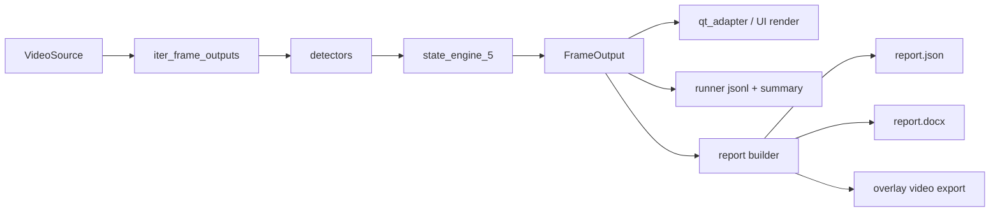

# Architecture

This document explains the system structure, runtime flow, and how each Python file participates.

## Entry Points (overview)
| Mode | Entry | Description |
| --- | --- | --- |
| UI | `src/app_qt.py` | PyQt6 UI (default); can run headless with `--headless`. |
| Headless | `src/runtime/app_runtime.py` | Headless-only entry; parses CLI and runs `run_headless`. |
| Launcher | `src/launcher.py` | Launcher UI (Realtime + Export flow). |
| Report | `src/cli/report_gen.py` | Offline report generator (JSON/DOCX/PDF) + optional overlay video export. |
| Tools | `tools/summarize_run.py` | Summarize `run_*.jsonl` into a metrics table. |
| Tools | `tools/dynamic_skip_infer.py` | Dynamic-skip analysis tool. |

## Data Flow

Notes:
- Dynamic-skip UI mode does not use `VideoSource`/`iter_frame_outputs`; it reads via `cv2.VideoCapture` in `ui_qt.worker.VideoWorker` and runs `PipelineRunner.process_frame`.

## Thread Model
- UI main thread: owns Qt widgets and QTimer. Converts BGR -> QImage -> QPixmap in `MainWindow.render_latest`.
- Worker/QThread: `ui_qt.worker.VideoWorker` performs capture + inference and emits `frame_ready(frame_bgr, FrameOutput)` plus `error(str)`.
- Dynamic-skip path: `VideoWorker` reads frames on a reader thread and runs `PipelineRunner.process_frame` inside the worker thread.
- Headless runner: `runtime.runner.run_headless` runs the same pipeline without UI, writing jsonl + summary files.
- Signal payloads: `frame_ready` carries `(frame_bgr: np.ndarray, meta: FrameOutput)`; UI uses the latest cached frame on each render tick.

## Output File Conventions
Typical outputs under `out\` (when `--test` or `--save-video` are used):
- `run_YYYYMMDD_HHMMSS.jsonl`: per-frame metrics (fps, display_fps, rt_ratio, perf_ms, stage_ms); written only with `--test`.
- `summary.json`: aggregated state summary for test runs; written only with `--test`.
- `results.md`: optional summary table written by `tools\summarize_run.py --write-results`.
- `*.mp4`: rendered output if `--save-video` is set (path depends on CLI).
Report outputs under `outputs\reports_MMDD_NN\` (when using `src.cli.report_gen`):
- `report_<video_stem>.docx`: formatted report document.
- `overlay_<video_stem>.mp4`: optional video overlay.
- `report\report_<video_stem>.json`: structured report data.
- `report\report_<video_stem>.pdf`: optional PDF (when enabled).
- `report\run_<video_stem>.jsonl`: per-frame log for the report run.
- `report\frames_meta_<video_stem>.jsonl`: temp meta for video export (removed after export).
Frozen exporter log:
- `outputs\export.log`: default log path for ReportExporter.exe (windowed build).
Launcher notes:
- Export flow runs in a background thread; closing during export prompts confirmation and logs `aborted_by_user`.
- Home shows device selection (auto/cpu/gpu) and CUDA availability with final resolved device.
- Export stats written to `outputs\export_stats.json` per device (cpu/gpu).
- Settings saved to `outputs\launcher_settings.json` (device mode + offline quality).
- Settings page includes a Back button; UI uses a Chinese font fallback for stable rendering.
- Ultra quality is disabled; settings with Ultra are downgraded to High and logged.

## How to Run (Windows)
- UI mode (local video):
  - `cd /d D:\23_detector && python -m src.app_qt --source "D:\path\to\demo.mp4"`
  - `cd /d D:\23_detector && python -m src.app_qt --source "D:\path\to\demo.mp4" --dynamic-skip`
- Headless 60s test (stable window):
  - `cd /d D:\23_detector && python -m src.app_qt --headless --source "D:\path\to\demo.mp4" --test --end-sec 1 --min-duration-s 60 --warmup-s 0.5`
- Summarize latest run:
  - `cd /d D:\23_detector && python tools\summarize_run.py --root "D:\23_detector" --warmup-s 0.5`
- Report generation (offline):
  - `cd /d D:\23_detector && python -m src.cli.report_gen --source "D:\path\to\demo.mp4"`
  - `cd /d D:\23_detector && python -m src.cli.report_gen --source "D:\path\to\demo.mp4" --export-video`

## Common Issues (checks)
- CUDA not used: `python -c "import torch; print(torch.cuda.is_available())"`
- Wrong video path: confirm "D:\path\to\demo.mp4" exists and is readable.
- Write permission errors: ensure `out\` is writable or pass `--out "D:\23_detector\out"`.
- Missing codecs: try another video file or verify OpenCV video backend.

## File Catalog (by module)

### EntryPoints

#### `src/app_qt.py`
- Responsibility: main entry; UI by default, headless with `--headless`.
- Key classes/functions: `main`.
- Inputs/Outputs: CLI args -> UI window or headless run.
- Called by: `python -m src.app_qt`.
- Calls/Depends on: `runtime.cli`, `runtime.config_overrides`, `runtime.runner`, `ui_qt.main_window`, `ui_qt.worker`.

#### `src/runtime/app_runtime.py`
- Responsibility: headless-only entry; resolves source and runs `run_headless`.
- Key classes/functions: `main`.
- Inputs/Outputs: CLI args -> headless run.
- Called by: `python -m src.runtime.app_runtime`.
- Calls/Depends on: `runtime.cli`, `runtime.config_overrides`, `runtime.runner`, `runtime.source_utils`.

#### `src/cli/report_gen.py`
- Responsibility: offline report pipeline; builds `report.json`, writes DOCX/PDF, and optionally exports overlay video.
- Key classes/functions: `main`.
- Inputs/Outputs: video path + report params -> report files in `outputs\reports_MMDD_NN\`.
- Called by: `python -m src.cli.report_gen`.
- Calls/Depends on: `runtime.pipeline`, `report.builder`, `report.writer_json`, `report.writer_docx`, `report.video_export`.
Notes:
- Frozen exe runs a progress dialog and writes logs to `outputs\export.log`.
- CLI help can run without torch; inference paths require torch.

#### `src/launcher.py`
- Responsibility: Home/Realtime/Export navigation with a single QApplication.
- Key classes/functions: `LauncherWindow`, `main`.
- Inputs/Outputs: user picks video; realtime opens DetectorUI window; export uses `ExportRunner`.
- Calls/Depends on: `src.app_qt.create_detector_window`, `src.export_runner`.
Notes:
- Device selection resolved via `src.core.device.resolve_device`.

### runtime

#### `src/runtime/cli.py`
- Responsibility: CLI definition and parsing.
- Key classes/functions: `build_parser`, `parse_args`.
- Inputs/Outputs: CLI flags -> `argparse.Namespace`.
- Called by: `src/app_qt.py`, `src/runtime/app_runtime.py`.
- Calls/Depends on: `argparse`.

#### `src/runtime/config_overrides.py`
- Responsibility: apply CLI overrides to `AppConfig`.
- Key classes/functions: `apply_cli_overrides`.
- Inputs/Outputs: `AppConfig`, CLI args -> mutated config.
- Called by: entrypoints.
- Calls/Depends on: `core.config`.

#### `src/runtime/frame_scheduler.py`
- Responsibility: dynamic skip scheduler for real-time pacing.
- Key classes/functions: `FrameScheduler`.
- Inputs/Outputs: timing metrics -> next frame step/ratio.
- Called by: `ui_qt.worker.VideoWorker` (dynamic-skip path).
- Calls/Depends on: none (pure logic).

#### `src/runtime/logger.py`
- Responsibility: logging setup and perf logging helpers.
- Key classes/functions: `setup_logging`, `get_logger`, `log_perf`.
- Inputs/Outputs: log configuration + perf lines.
- Called by: `src/app_qt.py`, `ui_qt.worker`.
- Calls/Depends on: `logging`.

#### `src/runtime/pipeline.py`
- Responsibility: core inference pipeline (read, infer, post, state).
- Key classes/functions: `iter_frame_outputs`, `PipelineRunner`.
- Inputs/Outputs: `VideoSource` -> `FrameOutput` (includes `metrics`; `stage_ms` only when using `iter_frame_outputs`).
- Called by: `runtime.runner`, `ui_qt.worker`.
- Calls/Depends on: detectors, filters, `engine.state_engine_5`, `io.video_source`.

#### `src/runtime/qt_adapter.py`
- Responsibility: UI adaptation (BGR->QImage, overlays, status DTO).
- Key classes/functions: `bgr_to_qimage`, `draw_detections`, `output_to_status`.
- Inputs/Outputs: `FrameOutput`/BGR -> `QImage` + `StatusDTO`.
- Called by: `ui_qt.main_window`.
- Calls/Depends on: `ui_qt.state_view_spec`, Qt.

#### `src/runtime/runner.py`
- Responsibility: headless loop; writes jsonl + summary.
- Key classes/functions: `run_headless`, `_payload_from_output`.
- Inputs/Outputs: `FrameOutput` -> stdout JSON + `run_*.jsonl` + `summary.json`.
- Called by: entrypoints.
- Calls/Depends on: `runtime.pipeline`, `runtime.summary`, `io.video_writer`.

#### `src/runtime/serialization.py`
- Responsibility: make objects JSON-serializable.
- Key classes/functions: `to_jsonable`.
- Inputs/Outputs: complex objects -> JSON-ready data.
- Called by: `runtime.runner`.
- Calls/Depends on: none.

#### `src/runtime/source_utils.py`
- Responsibility: source parsing/validation and save-size parsing.
- Key classes/functions: `resolve_source`, `validate_source`, `write_last_source`, `parse_save_size`.
- Inputs/Outputs: CLI args/path -> validated path + metadata.
- Called by: entrypoints, `ui_qt.worker`.
- Calls/Depends on: filesystem utilities.

#### `src/runtime/summary.py`
- Responsibility: aggregate state segments into summary report.
- Key classes/functions: `finalize_summary`, `print_test_report`.
- Inputs/Outputs: segments/transitions -> summary dict + console report.
- Called by: `runtime.runner`.
- Calls/Depends on: none.

#### `src/runtime/__init__.py`
- Responsibility: runtime package marker.
- Key classes/functions: none.
- Inputs/Outputs: none.
- Called by: imports of `src.runtime`.
- Calls/Depends on: Python import system.

### ui_qt

#### `src/ui_qt/main_window.py`
- Responsibility: Qt main window and UI rendering.
- Key classes/functions: `MainWindow`, `render_latest`, `on_frame`, `on_worker_error`.
- Inputs/Outputs: `frame_ready(frame_bgr, FrameOutput)` -> QPixmap + labels/table.
- Called by: `src/app_qt.py`.
- Calls/Depends on: `runtime.qt_adapter`, `ui_qt.state_view_spec`.

#### `src/ui_qt/worker.py`
- Responsibility: QThread worker; reads video and runs inference.
- Key classes/functions: `VideoWorker.run`, `frame_ready`, `error`.
- Inputs/Outputs: video source -> `(frame_bgr, FrameOutput)`; errors via `error`.
- Called by: `src/app_qt.py`.
- Calls/Depends on: `runtime.pipeline`, `runtime.frame_scheduler`, `io.video_writer`.

#### `src/ui_qt/state_view_spec.py`
- Responsibility: UI status DTO and state mapping.
- Key classes/functions: `StatusDTO`, `normalize_state`, `to_state_cn`, `to_state_color_rgb`.
- Inputs/Outputs: raw state/tags -> display fields and colors.
- Called by: `runtime.qt_adapter`, `ui_qt.main_window`.
- Calls/Depends on: none.

### detectors

#### `src/detectors/people_tracker_raw.py`
- Responsibility: YOLO people detector + tracker.
- Key classes/functions: `PeopleTrackerRaw.process`.
- Inputs/Outputs: BGR frame -> `PeopleRaw` with boxes.
- Called by: `runtime.pipeline`.
- Calls/Depends on: Ultralytics YOLO.

#### `src/detectors/sampling_close_raw.py`
- Responsibility: YOLO detector for sampling/close tags.
- Key classes/functions: `SamplingCloseRaw.process`.
- Inputs/Outputs: BGR frame -> `TagsRaw`.
- Called by: `runtime.pipeline`.
- Calls/Depends on: Ultralytics YOLO.

#### `src/detectors/blocking_raw.py`
- Responsibility: YOLO detector for blocking tags.
- Key classes/functions: `BlockingRaw.process`.
- Inputs/Outputs: BGR frame -> `TagsRaw`.
- Called by: `runtime.pipeline`.
- Calls/Depends on: Ultralytics YOLO.

#### `src/detectors/__init__.py`
- Responsibility: detectors package marker.
- Key classes/functions: none.
- Inputs/Outputs: none.
- Called by: imports of `src.detectors`.
- Calls/Depends on: Python import system.

### core

#### `src/core/config.py`
- Responsibility: configuration dataclasses (models, thresholds, runtime params).
- Key classes/functions: `AppConfig`, `DetectorConfig`, `SamplingCloseConfig`, `TestConfig`.
- Inputs/Outputs: defaults + CLI overrides -> config used across pipeline.
- Called by: entrypoints and workers.
- Calls/Depends on: `dataclasses`.

#### `src/core/types.py`
- Responsibility: shared data structures (`FrameOutput`, `StatusDTO` mapping inputs).
- Key classes/functions: `FrameOutput`, `Box`, `PeopleRaw`, `TagsRaw`, `StateResult`.
- Inputs/Outputs: data containers for pipeline/UI/metrics.
- Called by: runtime, UI, detectors.
- Calls/Depends on: `dataclasses`.

#### `src/core/__init__.py`
- Responsibility: core package marker.
- Key classes/functions: none.
- Inputs/Outputs: none.
- Called by: imports of `src.core`.
- Calls/Depends on: Python import system.

### io

#### `src/io/video_source.py`
- Responsibility: frame reader (OpenCV VideoCapture).
- Key classes/functions: `VideoSource.__iter__`, `get_video_time_s`.
- Inputs/Outputs: path -> `(frame_index, timestamp_ms, video_t_s, frame_bgr)`.
- Called by: `runtime.pipeline`.
- Calls/Depends on: OpenCV.

#### `src/io/video_writer.py`
- Responsibility: output video writer manager.
- Key classes/functions: `VideoWriterManager`.
- Inputs/Outputs: BGR frames -> saved video file.
- Called by: `runtime.runner`, `ui_qt.worker`.
- Calls/Depends on: OpenCV, filesystem.

#### `src/io/__init__.py`
- Responsibility: io package marker.
- Key classes/functions: none.
- Inputs/Outputs: none.
- Called by: imports of `src.io`.
- Calls/Depends on: Python import system.

### tools

#### `tools/dynamic_skip_infer.py`
- Responsibility: dynamic-skip performance tool.
- Key classes/functions: script entry (CLI).
- Inputs/Outputs: video path -> perf output to console.
- Called by: `python tools\dynamic_skip_infer.py ...`.
- Calls/Depends on: runtime pipeline + scheduler.

#### `tools/summarize_run.py`
- Responsibility: summarize `run_*.jsonl` metrics into a table.
- Key classes/functions: `summarize`, `main`.
- Inputs/Outputs: `run_*.jsonl` -> Markdown table + optional `results.md`.
- Called by: `python tools\summarize_run.py --root "D:\23_detector" --warmup-s 0.5`.
- Calls/Depends on: filesystem + json.

### filters

#### `src/filters/people_smoother.py`
- Responsibility: temporal smoothing for people tracking.
- Key classes/functions: `PeopleSmoother.update`.
- Inputs/Outputs: `PeopleRaw` -> `PeopleStable`.
- Called by: `runtime.pipeline`.
- Calls/Depends on: `core.types`.

#### `src/filters/sampling_close_smoother.py`
- Responsibility: temporal smoothing for sampling/close tags.
- Key classes/functions: `SamplingCloseSmoother.update`.
- Inputs/Outputs: `TagsRaw` -> `TagsStable`.
- Called by: `runtime.pipeline`.
- Calls/Depends on: `core.types`.

#### `src/filters/blocking_smoother.py`
- Responsibility: temporal smoothing for blocking/no_blocking tags.
- Key classes/functions: `BlockingSmoother.update`.
- Inputs/Outputs: `TagsRaw` -> `TagsStable`.
- Called by: `runtime.pipeline`.
- Calls/Depends on: `core.types`.

#### `src/filters/__init__.py`
- Responsibility: filters package marker.
- Key classes/functions: none.
- Inputs/Outputs: none.
- Called by: imports of `src.filters`.
- Calls/Depends on: Python import system.

### engine

#### `src/engine/state_engine_5.py`
- Responsibility: state machine for five-class state.
- Key classes/functions: `StateEngine5.compute`.
- Inputs/Outputs: tags -> `StateResult`.
- Called by: `runtime.pipeline`.
- Calls/Depends on: `core.types`.

#### `src/engine/__init__.py`
- Responsibility: engine package marker.
- Key classes/functions: none.
- Inputs/Outputs: none.
- Called by: imports of `src.engine`.
- Calls/Depends on: Python import system.

### package root

#### `src/__init__.py`
- Responsibility: project package marker.
- Key classes/functions: none.
- Inputs/Outputs: none.
- Called by: imports of `src`.
- Calls/Depends on: Python import system.

### report

#### `src/report/builder.py`
- Responsibility: build report structures from `FrameOutput` stream.
- Key classes/functions: `build_report`.
- Inputs/Outputs: frame outputs -> `Report` data model.
- Called by: `src/cli/report_gen.py`.
- Calls/Depends on: `report.types`, `report.utils_time`.

#### `src/report/writer_json.py`
- Responsibility: atomic write of `report.json`.
- Key classes/functions: `write_report_json`.
- Inputs/Outputs: `Report` -> JSON file.
- Called by: `src/cli/report_gen.py`.
- Calls/Depends on: filesystem utilities.

#### `src/report/writer_docx.py`
- Responsibility: generate formatted DOCX report.
- Key classes/functions: `write_report_docx`.
- Inputs/Outputs: `Report` -> `report.docx`.
- Called by: `src/cli/report_gen.py`.
- Calls/Depends on: `python-docx`.

#### `src/report/video_export.py`
- Responsibility: export overlay video aligned to report data.
- Key classes/functions: `export_overlay_video`.
- Inputs/Outputs: report + frame metadata -> `overlay_*.mp4`.
- Called by: `src/cli/report_gen.py`.
- Calls/Depends on: OpenCV, `tqdm`.
